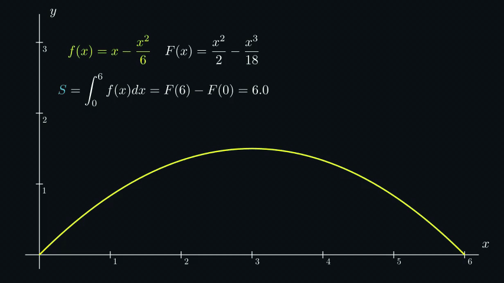
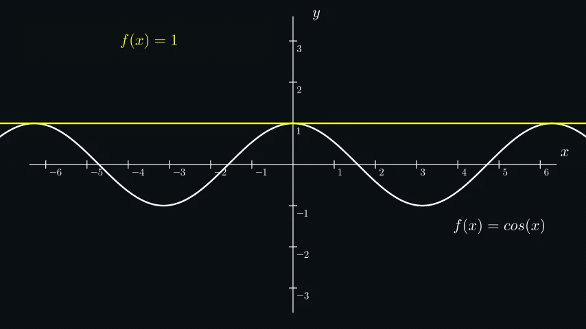

# Calculus

* [Derivatives](#derivatives)
    * [The Average Rate of Change](#the-average-rate-of-change)
    * [The Instant Rate of Change (The Derivative)](#the-instant-rate-of-change-the-derivative)
    * [Manual Derivative Calculation](#manual-derivative-calculation)
    * [Higher Order Derivatives](#higher-order-derivatives)
    * [Maximums and Minimums of a Function](#maximums-and-minimums-of-a-function)
    * [Partial Derivatives](#partial-derivatives)
    * [The Gradient of a Function](#the-gradient-of-a-function)
* [Integrals](#integrals)
    * [Antiderivatives](#antiderivatives)
    * [The Fundamental Theorem of Calculus](#the-fundamental-theorem-of-calculus)
* [Function Approximation](#function-approximation)
    * [Taylor Series](#taylor-series)

## Derivatives

### The Average Rate of Change

The **average rate of change** for $f(x)$ on the interval $[a, b]$ is **the slope of a secant line** between two points
$(a, f(a))$ and $(b, f(b))$.

Numerically, the slope of a secant line equals **rise over run**:

```math
m = \frac{\Delta{y}}{\Delta{x}} = \frac{f(x_{b}) - f(x_{a})}{x_{b} - x_{a}}
```

We can find a full formula of a secant line using a **line formula $y = mx + b$ and plugging in the slope and the
coordinates of any intersection point** ($a$ or $b$).


In the example above, we calculated the average rate of change on the interval $[a, b]$. Now **let's give these values
some real-world meaning**. Let's consider I went for a walk and **this graphic shows a distance from me to my home over
time**. $y$ denotes a distance in kilometers and $x$ denotes time in hours I spent walking.

So, the average rate of change of the distance I walked on the interval from the 5th hour of my trip until the 7th hour
is approximately $0.145. What's the average rate of change of the distance? **It's speed** (or velocity in this case,
to be precise). This means that my average velocity at this interval was approximately $145 m/h$.

### The Instant Rate of Change (The Derivative)

The idea of the **instant rate of change** (which is also called a **derivative**) is similar to the
[average rate of change](#the-average-rate-of-change), but the **run is approaching zero**.

If we set $h = x_{b} - x_{a}$, we can rewrite the formula of the average rate of change:

```math
m = \frac{f(x + h) - f(x)}{h}
```

To get the formula of the instant rate of change (derivative), $h$ must be approaching 0:

```math
m = \frac{df}{dx} = \lim_{h \to 0}\frac{f(x + h) - f(x)}{h}
```

It doesn't matter if we **approach the point from the right or the left side** (assuming both limits exist) we get the
same result:

```math
\lim_{h \to 0}\frac{f(x + h) - f(x)}{h} = \lim_{h \to 0}\frac{f(x) - f(x - h)}{h}
```

Conceptually, the **idea of an instant rate of change doesn't make any sense**, cause no change happens instantly. But
if we look at a graph of a function, we can clearly tell what the function is doing *(like increasing or decreasing)* at
any given point where it's defined.

Graphically, the **instant rate of change** for $f(x)$ at the point $a$ is **the slope of a tangent line** at a point
$a$. The smaller $h$ we take for the calculation - the better result we get. We can illustrate that as we're moving
points closer to each other, so they almost meet at a certain point $a$ in between:


Let's again **give these values some real-world meaning**. If this graphic represents **a distance from me to my home
over time** when I went for a walk *(just like in the [average rate of change](#the-average-rate-of-change) example)*,
the **instant rate of change** actually represents my real velocity at any given moment of time.

### Manual Derivative Calculation

The approach above is usually used in **computers to calculate the derivative**, but it only gives an **approximated
result**. If we directly plug in $h=0$ into the derivative formula, we get an **indeterminate expression**:

```math
\frac{f(x + h) - f(x)}{h} = \frac{f(x + 0) - f(x)}{0} = \frac{0}{0}
```

To calculate the exact value, we need to use some algebra. Let's take a simple function $f(x) = x^3$ as an example and
let's try to calculate the value of the derivative:

```math
\lim_{h \to 0}\frac{(x + h)^3 - x^3}{h} = \lim_{h \to 0}\frac{x^3 + h^3 + 3x^2h + 3xh^2 - x^3}{h} =
\lim_{h \to 0}(h^2 + 3x^2 + 3xh)
```

Now, if we plug in $h=0$:

```math
0^2 + 3x^2 + 3x * 0 = 3x^2
```

This is exactly the derivative that we get for $f(x) = x^3$ with the power rule of
[rules of computation](https://en.wikipedia.org/wiki/Derivative#Rules_of_computation).

Let's manually calculate the exact derivative for the example function of the previous section using the power rule of
computation. The function I used in that example is *(I know it's not pretty)*:

```math
f(x) = 0.0003x^5 - 0.012x^4 + 0.164x^3 - 0.931x^2 + 2.045x
```

The derivative of this function is:

```math
\frac{df}{dx} = 0.0015x^4 - 0.048x^3 + 0.492x^2 - 1.862x + 2.045
```

Now, if we plug $x=6$ in the exact derivative function we get:

```math
0.0015 * 6 ^ 4 - 0.048 * 6 ^ 3 + 0.492 * 6 ^ 2 - 1.862 * 6 + 2.045 = 1.944 - 10.368 + 17.712 - 11.172 + 2.045 = 0.161
```

Using $h = 0.0001$, the value of the derivative at the point $x=6$ calculated by the computer in the previous section is
**$0.161$**, which is exactly what we got manually. Usually, we're not that lucky, and derivatives calculated by a
computer have some deviations, but it's totally fine for many use cases. Also, the smaller $h$ we take, the better
result we get.

### Higher Order Derivatives

While [manually calculating a derivative](#manual-derivative-calculation) of a function, we clearly saw that the
derivative itself is also a function. It means that we can take a derivative of a derivative. The derivative of a
derivative is called a **second-order derivative**, but we can repeat this process as many times as we need to get any
**higher-order derivatives**.


Let's **give these values some real-world meaning** again. We already know that the first derivative of a distance
function represents velocity. But what is **the instant change of velocity** (the second derivative)? It's
**acceleration**.

It's **usually hard to find meaning for even higher order derivatives**, but they are still often used, for example, in
statistics or machine learning.

### Maximums and Minimums of a Function

If you look closely at the graph of the derivatives you'll see that **when the derivative of a function crosses the $x$
axis, the function itself has either the biggest or the smallest local value at the same $x$ coordinate**:


It totally makes sense if you go back to the slope definition of the derivative. When the sign of a slope changes, the
function changes the direction of movement and the point where this change happens usually represents either a local
maximum or a local minimum value. The same works for higher derivatives.

### Partial Derivatives

For multivariable functions, for example $f(x,y)$, it's often useful to analyze how each variable affects the function
separately. **Partial derivatives** allow us to do that.

**To calculate a partial derivative, we calculate a derivative with respect to one of the variables, with the other ones
held constant.**

Let's calculate a partial derivative of this function with respect to the variable $x$:

```math
f(x,y) = cos(x) sin(y)
```
```math
\frac{\partial}{\partial x}f(x,y) = -sin(x) sin(y)
```

If we choose any point of this function, the value of the partial derivative with respect to $x$ shows us how much an
increase of $x$ variable increases the function itself at this point. **If we take both partial derivatives and compare
them, we can say which variable affects the function more at any given point.**

Graphically, we can represent a partial derivative of a multivariable function in 3D exactly the same way as we do with
a single variable function in 2D. The value of a partial derivative of $f(x,y)$ with respect to $x$ at a point $a$ is
**the slope of a line tangent to the intersection graph (slice) of the $f(x,y)$ and the plane, parallel to $x$ and $z$
axes passing through this point**. Since we calculate everything with respect to $x$, $y$ becomes a constant in all
calculations.


**Partial derivatives are not limited to the 2-variable functions, but it's hard to visualize any space with more than 3
dimensions.**

### The Gradient of a Function

Using [partial derivatives](#partial-derivatives), we can calculate how an increase of each variable of a multivariable
function increases the function at any given point. If we put the values of partial derivatives at any given point in a
[vector](../linear-algebra/README.md#introduction-to-vectors), it will point to the direction of the fastest increase of
the function at this point. This vector is called the **gradient vector**.

The Gradient is denoted by the nabla symbol $\nabla$ (which is pronounced as "del"):

```math
\nabla f(x,y) = 
\begin{bmatrix}
\frac{\partial}{\partial x}f(x,y)\\
\frac{\partial}{\partial y}f(x,y)
\end{bmatrix}
```

Graphically it looks like this **(note that the gradient vector is actually a 2D vector in $x, y$ plane)**:


Again, mathematically we can work with as many dimensions as we need, so the generic notation looks like this:

```math
\nabla f(x_{1}, x_{2}, \ldots, x_{n}) = 
\begin{bmatrix}
\frac{\partial}{\partial x_1}f(x_{1}, x_{2}, \ldots, x_{n}) \\
\frac{\partial}{\partial x_2}f(x_{1}, x_{2}, \ldots, x_{n}) \\
\vdots \\
\frac{\partial}{\partial x_n}f(x_{1}, x_{2}, \ldots, x_{n}) 
\end{bmatrix}
```

It might be a little confusing **why putting these values in a vector gives us the direction of the fastest increase of
the function**, but it's actually pretty simple. It's logical that we should nudge the variable that gives the function
a bigger increase more than the other variables. But how more? This is exactly what partial derivatives tell us.
**Increasing variables proportionally to their derivatives gives us the best increase of the function overall.** And
this is exactly what gradient vector does.

Pay attention that since it's the calculus world **the "increase" is actually very small** (ideally approaches 0). To
get the shortest path to the local maximum of a function, we need to recalculate the gradient vector after every
increase. **The smaller steps we take the shorter path we get.**

## Integrals

### Antiderivatives

We already know the [derivative of a distance function gives us velocity](#the-instant-rate-of-change-the-derivative).
But we can also go backwards and find the distance function from the velocity one. **The process of finding an
antiderivative function is called integration**.

The **integral notation** is written like this:

```math
f(x) = \int f'(x)dx
```

We know that the derivative of a constant equals $0$, so we lose information about constants during differentiation. It
means that **during integration we find not a single function, but a class of functions**, because there may be
unlimited number of additional constants in the original function.

Let's find an antiderivative of a simple function using the [power rule](https://en.wikipedia.org/wiki/Power_rule):

```math
f(x) = \int 3x^2 dx = x^3 + C
```

Notice, that $C$ is an integration constant that was lost during differentiation, and it can be any number.

### The Fundamental Theorem of Calculus

Let's again assume that the function represents velocity. If the velocity is constant on the interval its graphic looks
like a line. We know from physics that **distance is velocity multiplied by time**. If we **draw a rectangle under this
graph, we see that one side represents velocity and another represents time**. This means that we **calculate the
distance traveled exactly the same way we calculate the area of this rectangle**. If the velocity is not constant, we
can still represent it with rectangles. We just need more of them. Then, we calculate the area of each rectangle and sum
the results. The end result will still show us the distance traveled, just with a rounding error. The more rectangles we
use, the better the result we get.

Another logical way to **calculate the distance traveled is to subtract the start point from the destination**. The
distance function is an antiderivative of the velocity function, so if we know the antiderivative, we know the values of
both points and can easily calculate the distance. **The Fundamental Theorem of Calculus links the concept of
calculating the area under the function to the function's antiderivative.**

The **definite integral** can be used to calculate the area under the graph on some interval $[a,b]$. If $F'(x) = f(x)$,
then:

```math
\int_{a}^{b} f(x)dx = F(b) - F(a)
```

Notice that we don't care about what antiderivative we choose, because **the constants cancel each other out**.



## Function Approximation

**Function Approximation is a technique for selecting a function that closely matches a target function** (known or
unknown and underlying).

There are 2 major classes of function approximation problems:

- **Approximating a known function**. It's useful when the original function is too complicated for calculations, and
  we select an approximate function which behaves very similarly for the particular problem, but works better for
  calculations.
- **Approximating an unknown underlying function by its data points**. In many cases, to solve problems we work with
  functions instead of data points, so we first need to find one.

### Taylor Series

For most common functions, the infinite sum of terms that are expressed in terms of the function's derivatives at a
single point equals the function near this point. To say it simpler, **if we choose a polynomial where all its
derivatives equal the derivatives of a function at a given point, this polynomial will behave very closely to the
function itself**. This polynomial is called **Taylor Series**.

Mathematically it looks like this:

```math
f(x) \approx f(a)+f'(a)(x-a)+\frac{f''(a)}{2!}(x-a)^2+\frac{f'''(a)}{3!}(x-a)^3+\cdots
```

or:

```math
f(x) \approx \sum_{i=0}^{n} \frac{f^{(i)}(a)}{i!}(x-a)^i
```

It looks complicated, but if we need to approximate a function around $0$, this expression can be simplified (it's
also called Maclaurin series):

```math
f(x) \approx f(0)+f'(0)x+\frac{f''(0)}{2!}x^2+\frac{f'''(0)}{3!}x^3+\cdots
```

Let's approximate $f(x) = cos(x)$ around $0$. $cos(0) = 1$ so the first term of our polynomial is $1$:

```math
f(x) = 1
```

The derivative of $cos(x)$ is $-sin(x)$ which equals $0$ at $x=0$. The derivative of $f(x) = 1$ is already $0$, so
there's no need to add a second term to it. The second derivative of $cos(x)$ is $-cos(x)$, which equals $-1$ at $x=0$.
Using the [power rule](https://en.wikipedia.org/wiki/Power_rule) we see that the second derivative of $x^2$ is
$1 \cdot 2 \cdot x^0 = 2$. To make it equal $-1$ we need to multiply it by $-\frac{1}{2}$. So our polynomial should look
like this now:

```math
f(x) = 1 - \frac{1}{2}x^2
```

This is already a pretty good approximation for many use cases, but we can do even better. The third derivative of
$cos(x)$ is $sin(x)$ which again equals $0$ at $x=0$. Since the third derivative of our current polynomial is already
$0$ we, again, skip the term. The fourth derivative of $cos(x)$ is $cos(x)$ and equals $1$ at $x=0$. The fourth
derivative of $x^4$ is $1 \cdot 2 \cdot 3 \cdot 4 \cdot x^0=24$. To make it equal $1$ we need to multiply it by
$\frac{1}{24}$. So our polynomial should look like this now:

```math
f(x) = 1 - \frac{1}{2}x^2 + \frac{1}{24}x^4
```

This is a very good approximation and we can stop here. Here's how it looks graphically:

