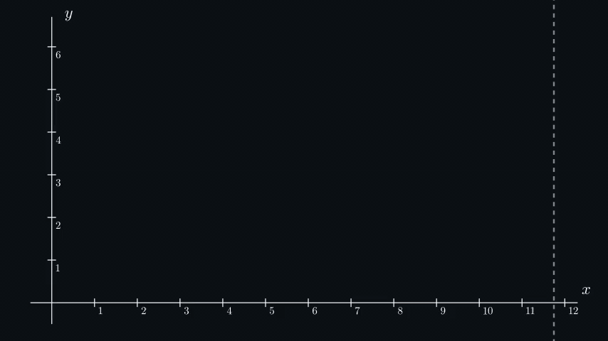
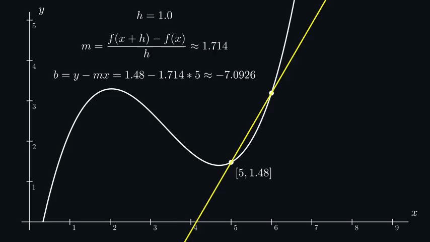
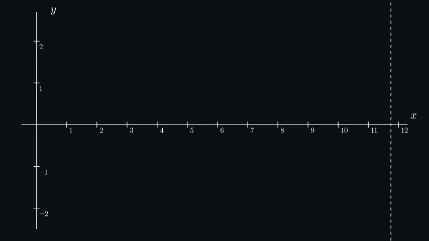

# Calculus
* [Derivative](#derivative)
    * [The Average Rate of Change](#the-average-rate-of-change)
    * [The Instant Rate of Change (Derivative)](#the-instant-rate-of-change-derivative)
    * [Manual Derivative Calculation](#manual-derivative-calculation)
    * [Higher Order Derivatives](#higher-order-derivatives)
    * [Maximums and Minimums of a Function](#maximums-and-minimums-of-a-function)

## Derivative

### The Average Rate of Change

The **average rate of change** for $f(x)$ on the interval $[a, b]$ is **the slope of a secant line** between two points
$(a, f(a))$ and $(b, f(b))$.

Numerically, the slope of a secant line equals **rise over run**:

```math
m = \frac{\Delta{y}}{\Delta{x}} = \frac{f(x_{b}) - f(x_{a})}{x_{b} - x_{a}}
```

We can find a full formula of a secant line using a **line formula $y = mx + b$ and plugging in the slope and the
coordinates of any intersection point** ($a$ or $b$).



In the example above, we calculated the average rate of change on the interval $[a, b]$. Now **let's give these values
some real-world meaning**. Let's consider I went for a walk and **this graphic shows a distance from me to my home over
time**. $y$ denotes a distance in kilometers and $x$ denotes time in hours I spent walking.

So, the average rate of change of the distance I walked on the interval from the 5th hour of my trip until the 7th hour
is approximately $0.145. What's the average rate of change of the distance? **It's speed** (or velocity in this case,
to be precise). This means that my average velocity at this interval was approximately $145 m/h$.

### The Instant Rate of Change (Derivative)

The idea of the **instant rate of change** (which is also called a **derivative**) is similar to the
[average rate of change](#the-average-rate-of-change), but the **run is approaching zero**.

If we set $h = x_{b} - x_{a}$, we can rewrite the formula of the average rate of change:

```math
m = \frac{f(x + h) - f(x)}{h}
```

To get the formula of the instant rate of change (derivative), $h$ must be approaching 0:

```math
m = \frac{df}{dx} = \lim_{h \to 0}\frac{f(x + h) - f(x)}{h}
```

It doesn't matter if we **approach the point from the right or the left side** (assuming both limits exist) we get the
same result:

```math
\lim_{h \to 0}\frac{f(x + h) - f(x)}{h} = \lim_{h \to 0}\frac{f(x) - f(x - h)}{h}
```

Conceptually, the **idea of an instant rate of change doesn't make any sense**, cause no change happens instantly. But
if we look at a graph of a function, we can clearly tell what the function is doing *(like increasing or decreasing)* at
any given point where it's defined.

Graphically, the **instant rate of change** for $f(x)$ at the point $a$ is **the slope of a tangent line** at a point
$a$. The smaller $h$ we take for the calculation - the better result we get. We can illustrate that as we're moving
points closer to each other, so they almost meet at a certain point $a$ in between:



Let's again **give these values some real-world meaning**. If this graphic represents **a distance from me to my home
over time** when I went for a walk *(just like in the [average rate of change](#the-average-rate-of-change) example)*,
the **instant rate of change** actually represents my real velocity at any given moment of time.

### Manual Derivative Calculation

The approach above is usually used in **computers to calculate the derivative**, but it only gives an **approximated
result**. If we directly plug in $h=0$ into the derivative formula, we get an **indeterminate expression**:

```math
\frac{f(x + h) - f(x)}{h} = \frac{f(x + 0) - f(x)}{0} = \frac{0}{0}
```

To calculate the exact value, we need to use some algebra. Let's take a simple function $f(x) = x^3$ as an example and
let's try to calculate the value of the derivative:

```math
\lim_{h \to 0}\frac{(x + h)^3 - x^3}{h} = \lim_{h \to 0}\frac{x^3 + h^3 + 3x^2h + 3xh^2 - x^3}{h} =
\lim_{h \to 0}(h^2 + 3x^2 + 3xh)
```

Now, if we plug in $h=0$:

```math
0^2 + 3x^2 + 3x * 0 = 3x^2
```

This is exactly the derivative that we get for $f(x) = x^3$ with the power rule of
[rules of computation](https://en.wikipedia.org/wiki/Derivative#Rules_of_computation).

Let's manually calculate the exact derivative for the example function of the previous section using the power rule of
computation. The function I used in that example is *(I know it's not pretty)*:

```math
f(x) = 0.0003x^5 - 0.012x^4 + 0.164x^3 - 0.931x^2 + 2.045x
```

The derivative of this function is:

```math
\frac{df}{dx} = 0.0015x^4 - 0.048x^3 + 0.492x^2 - 1.862x + 2.045
```

Now, if we plug $x=6$ in the exact derivative function we get:

```math
0.0015 * 6 ^ 4 - 0.048 * 6 ^ 3 + 0.492 * 6 ^ 2 - 1.862 * 6 + 2.045 = 1.944 - 10.368 + 17.712 - 11.172 + 2.045 = 0.161
```

Using $h = 0.0001$, the value of the derivative at the point $x=6$ calculated by the computer in the previous section is
**$0.161$**, which is exactly what we got manually. Usually, we're not that lucky, and derivatives calculated by a
computer have some deviations, but it's totally fine for many use cases. Also, the smaller $h$ we take, the better
result we get.

### Higher Order Derivatives

While [manually calculating a derivative](#manual-derivative-calculation) of a function, we clearly saw that the
derivative itself is also a function. It means that we can take a derivative of a derivative. The derivative of a
derivative is called a **second-order derivative**, but we can repeat this process as many times as we need to get any
**higher-order derivatives**.


Let's **give these values some real-world meaning** again. We already know that the first derivative of a distance
function represents velocity. But what is **the instant change of velocity** (the second derivative)? It's
**acceleration**.

It's **usually hard to find meaning for even higher order derivatives**, but they are still often used, for example, in
statistics or machine learning.

### Maximums and Minimums of a Function

If you look closely at the graph of the derivatives you'll see that **when the derivative of a function crosses the $x$
axis, the function itself has either the biggest or the smallest local value at the same $x$ coordinate**:



It totally makes sense if you go back to the slope definition of the derivative. When the sign of a slope changes, the
function changes the direction of movement and the point where this change happens usually represents either a local 
maximum or a local minimum value. The same works for higher derivatives.
