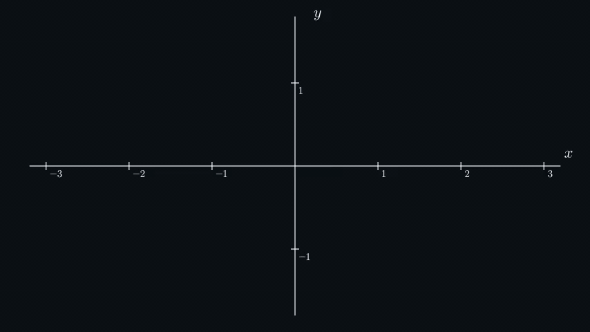
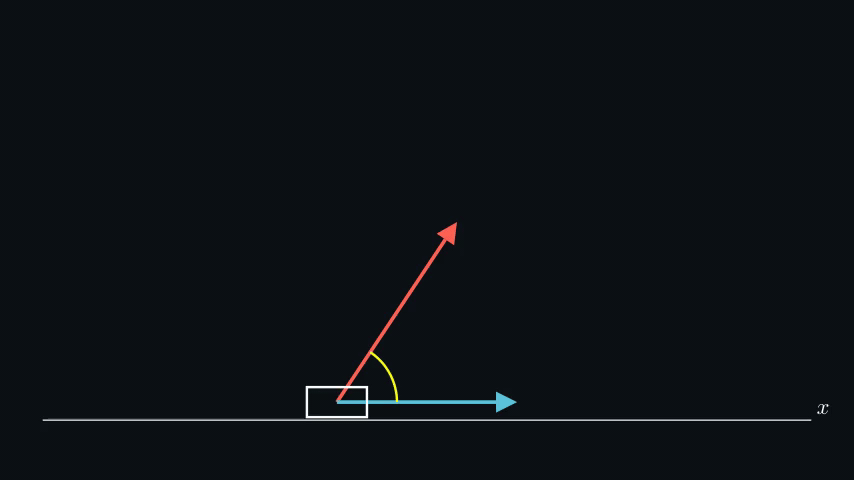
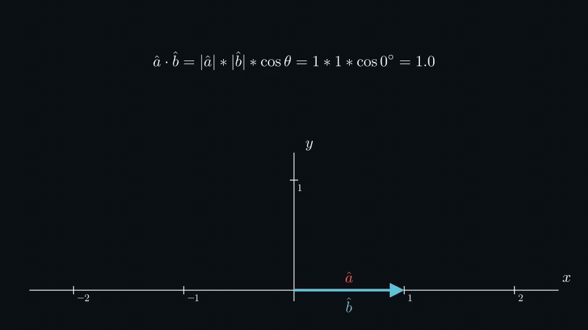

# Linear Algebra
* [Introduction to Vectors](#introduction-to-vectors)
    * [Vector Magnitude and Direction](#vector-magnitude-and-direction)
    * [Vector Addition](#vector-addition)
    * [Vector Scalar Multiplication](#vector-scalar-multiplication)
    * [Vector Linear Combination](#vector-linear-combination)
    * [Vector Linear Dependence](#vector-linear-dependence)
    * [Vector Span and Basis](#vector-span-and-basis)
    * [Vector Space](#vector-space)
    * [Vector Dot Product](#vector-dot-product)
    * [Vector Cross Product](#vector-cross-product)
    * [Calculating Angles Between Vectors](#calculating-angles-between-vectors)
* [Introduction to Matrices](#introduction-to-matrices)
    * [Matrix Addition](#matrix-addition)
    * [Matrix Multiplication](#matrix-multiplication)
* [Linear Transformations](#linear-transformations)
    * [Linear Transformation Composition](#linear-transformation-composition)
    * [Linear Transformation Invertible](#linear-transformation-invertible)
    * [Linear Transformation Dimensions](#linear-transformation-dimensions)
    * [Linear Transformation Determinant](#linear-transformation-determinant)

## Introduction to Vectors


A vector may have many definitions: a point in space, an ordered list of numbers, a quantity with magnitude and
direction, etc. More abstractly, a vector is simply an element of a [vector space](#vector-space). All these diverse
things are gathered under the common name of vector because, for certain types of questions, a common way of reasoning
can be applied to all of them.

A vector can be written in matrix notation:

```math
\vec{a} = 
\begin{bmatrix} 
a_{1}   \\ 
a_{2}   \\
\cdots  \\
a_{n}
\end{bmatrix}
```

### Vector Magnitude and Direction

The **magnitude of a vector** ( $|\vec{a}|$ ) is the distance from the endpoint of the vector to the origin. It's a
number that represents the length of the vector independent of the direction. To calculate the magnitude of a vector,
we can use the [Pythagorean theorem](https://en.wikipedia.org/wiki/Pythagorean_theorem):

```math
|\vec{a}|=\sqrt{a_{x}^2 + a_{y}^2}
```

```math
|\vec{a}|=\sqrt{a_{x}^2 + a_{y}^2 + a_{z}^2}
```

A **unit (normalized) vector** ( $\hat{a}$ ), on the other hand, represents the direction of the vector independent of
its length. The magnitude of a unit vector is always 1. To calculate the unit vector of any vector, we take the
original vector and divide it by its magnitude:

```math
\hat{a} = \frac{\vec{a}}{|\vec{a}|}
```

We can use these two components to re-create the original vector by multiplying the unit vector by the length of the
original vector:

```math
\vec{a} = \hat{a} * |\vec{a}|
```


### Vector Addition

Graphically, we can think of **adding two vectors** together as placing these vectors so the tail of the second one
sits on the tip of the first one. The sum is a vector drawn from the origin to the tip of the second vector.

**Vector subtraction** works similarly. We place the tip of the smaller vector to sit on the tip of the bigger one and
draw the result vector from the origin to the tail of the smaller vector.

Numerically, we add/subtract vectors **component by component**:

```math
\vec{c} = \vec{a} + \vec{b} = \begin{bmatrix} a_{x} + b_{x} \\ a_{y} + b_{y} \end{bmatrix}
```

```math
\vec{c} = \vec{a} + \vec{b} = \begin{bmatrix} a_{x} + b_{x} \\ a_{y} + b_{y} \\ a_{z} + b_{z} \end{bmatrix}
```


### Vector Scalar Multiplication

Graphically, we **multiply a vector by a number (scalar)** to either stretch or squish the vector (scale it).
Multiplying a vector by a negative number also **flips its direction**.

Numerically, we multiply/divide every **vector's component by the number**:

```math
\vec{a} * c = \begin{bmatrix} a_{x} * c \\ a_{y} * c \end{bmatrix}
```

```math
\vec{a} * c = \begin{bmatrix} a_{x} * c \\ a_{y} * c \\ a_{z} * c \end{bmatrix}
```


### Vector Linear Combination

**Linear combinations** of vectors are obtained by using [vector addition](#vector-addition) and
[vector scalar multiplication](#vector-scalar-multiplication). For example, a linear combination of vectors
$\vec{v_{1}}$ and $\vec{v_{2}}$ would be an expression of the form $c_{1}\vec{v_{1}} + c_{2}\vec{v_{2}}$, where $c_{1}$
and $c_{2}$ are some constants.

### Vector Linear Dependence

Vectors are said to be **linearly dependent** if there exists a nontrivial (where scalars are not all zero)
[linear combination](#vector-linear-combination) of the vectors that equals the zero vector:

```math
c_{1}\vec{v_{1}} + c_{2}\vec{v_{2}} + ... + c_{n}\vec{v_{n}} = 0
```

If the set of vectors is **infinite**, the vectors in it are considered to be linearly dependent if the set contains a
**finite subset that is linearly dependent**.

Graphically, vectors are linearly dependent if **two vectors are on the same line** (for 2D) or if **three vectors are
on the same plane** (for 3D). It means that **one vector can be expressed as a linear combination of the other/s**. The
maximum number of possible linearly independent vectors is the same as the dimension of the
[vector space](#vector-space).


### Vector Span and Basis

The **span** of vectors is the set of all their [linear combinations](#vector-linear-combination). The **basis** of a
[vector space](#vector-space) is a set of linearly independent vectors that **span** the full space. For example, by
using linear combinations of any two linearly independent vectors, we can create any vector in the 2D space.

The **basis** vectors in the $x,y,z$ coordinate system are vectors $\hat{i},\hat{j},\hat{k}$ (i-hat, j-hat, and k-hat).
We can use these basis vectors to describe any other vector of 2D/3D space. For example a vector with coordinates
`[1.5, 0.5]` can be described this way:

```math
\begin{bmatrix} 1.5 \\ 0.5 \end{bmatrix} = (1.5 * \hat{i}) + (0.5 * \hat{j})
```



### Vector Space

A **vector space $\mathbb{V}$**, simplified, is a collection of vectors, along with two defined operations you can do
on them: [vector addition](#vector-addition) and [scalar multiplication](#vector-scalar-multiplication).
Vector spaces are characterized by their dimension, which specifies the maximum number
of [linearly independent](#vector-linear-dependence) vectors in the space.

To have a vector space, the **eight following axioms must be satisfied**:

- Associativity of vector addition:
  $`\vec{u} + (\vec{v} + \vec{w}) = (\vec{u} + \vec{v}) + \vec{w}`$;
- Commutativity of vector addition:
  $`\vec{u} + \vec{v} = \vec{v} + \vec{u}`$;
- Identity element of vector addition (zero vector $\vec{0}$):
  $`\vec{v} + \vec{0} = \vec{v}`$;
- Inverse elements of vector addition:
  $`\vec{v} + (-\vec{v}) = \vec{0}`$;
- Compatibility of scalar multiplication with field multiplication:
  $`a(b\vec{v}) = (ab)\vec{v}`$;
- Identity element of scalar multiplication:
  $`1\vec{v} = \vec{v}`$;
- Distributivity of scalar multiplication with respect to vector addition:
  $`a(\vec{v} + \vec{u}) = a\vec{v} + a\vec{u}`$;
- Distributivity of scalar multiplication with respect to field addition:
  $`(a + b)\vec{v} = a\vec{v} + b\vec{v}`$.

Usually, we work with **real vector spaces $\mathbb{R}^n$** and **finite dimensions $n$**. A real vector space is a
vector space whose field of scalars is the field of [reals](https://en.wikipedia.org/wiki/Real_number) $\mathbb{R}$.

A [field](https://en.wikipedia.org/wiki/Field_mathematics) $\mathbb{F}$, simply speaking, is a set on which addition,
subtraction, multiplication, and division are defined such that the usual rules of algebra hold. The rules for fields
are more restrictive than ones for vector spaces (for example,
[multiplicative inverse](https://en.wikipedia.org/wiki/Multiplicative_inverse) is not explicitly defined for vectors
but is one of the field axioms). Thus, as a special case, a field is also a vector space over itself (for example,
$\mathbb{R}^n$ where $n=1$).

### Vector Dot Product

Numerically, the dot product can be calculated by multiplying vectors component-by-component and then adding the
results:

```math
\vec{a} \cdot \vec{b} = \begin{bmatrix} a_{x} \\ a_{y} \end{bmatrix} \cdot 
\begin{bmatrix} b_{x} \\ b_{y} \end{bmatrix} = a_{x} * b_{x} + a_{y} + b_{y}
```

The result of dot product is **always a scalar**.

This formula can be extended to work with **N-dimensional** vectors, but **can't be used with more than two vectors**:

```math
\vec{a} \cdot \vec{b} = \sum_{i=1}^N a_{i} * b_{i}
```

Geometrically, we can calculate dot product using another formula, which comes from the
[Law of Cosines](https://en.wikipedia.org/wiki/Law_of_cosines):

```math
\vec{a} \cdot \vec{b} = |\vec{a}| * |\vec{b}| * \cos(\theta)
```

The purpose of the dot product is to give us useful **information about angles and lengths simultaneously**. For
example, we use the dot product to calculate the work $W$ produced by a force $\vec{F}$ and caused the displacement
$\vec{s}$:



In some cases, we don't care about the length, we only care about how much vectors are **pointing in the same
direction**. In this case, it's a lot easier to work with unit vectors. The dot product of two unit vectors equals
**the cosine value of the angle between them**. There are three most important angles for cosine: $0^{\circ}$ where
cosine equals 1, $90^{\circ}$ where cosine equals 0 and $180^{\circ}$ where cosine equals -1.



### Vector Cross Product

Let's start with 3D geometric representation first. The **cross product of two
[linearly independent](#vector-linear-dependence) vectors $\vec{a}\times\vec{b}$ is a vector**, which is perpendicular
to both $\vec{a}$ and $\vec{b}$, and thus normal to the plane containing them. This vector can be calculated using this
formula:

```math
\vec{a} \times \vec{b} = \hat{n} |\vec{a}|| \vec{b}| \sin\theta
```

where $\hat{n}$ is the unit vector perpendicular to both $\vec{a}$ and $\vec{b}$, and $\theta$ is the angle between
$\vec{a}$ and $\vec{b}$.


The cross product of vectors in 2D space is not exactly defined. But its magnitude can still be calculated. **The
magnitude of the cross product equals the area of a parallelogram with the vectors for sides**. The result of the cross
product for two vectors in **2D space $|\vec{a} \times \vec{b}|$ is a scalar, which represents the area of this
parallelogram**.

Unlike the [dot product](#vector-dot-product), the cross product says **how different vectors are**, but with a nuance.
The cross product of two vectors is the biggest when they are **perpendicular to each other**.


Also, pay attention that the cross product is **anticommutative**:

```math
\vec{a} \times \vec{b} = -\vec{b} \times \vec{a}
```

The cross product is commonly used in computer graphics to calculate **the normal for a triangle or polygon** or in
physics to calculate **angular momentum and torque**.

Finally, let's calculate the cross product of two vectors numerically, using their components. The cross product can be
expressed in [matrix notation](#introduction-to-matrices) as a [formal determinant](#linear-transformation-determinant):

```math
\vec{a} \times \vec{b} = \begin{vmatrix}
\hat{i} & \hat{j} & \hat{k} \\
a_1 & a_2 & a_3 \\
b_1 & b_2 & b_3
\end{vmatrix} = (a_2b_3-a_3b_2)\hat{i} + (a_3b_1-a_1b_3)\hat{j}+(a_1b_2-a_2b_1)\hat{k}
```

### Calculating Angles Between Vectors

Geometrical representation of both [dot product](#vector-dot-product) and [cross product](#vector-cross-product) can be
used to **calculate an angle between two vectors**:

```math
\theta = \arccos \frac{\vec{a} \cdot \vec{b}}{|\vec{a}||\vec{b}|}
```

```math
\theta = \arcsin \frac{|\vec{a} \times \vec{b}|}{|\vec{a}||\vec{b}|}
```

## Introduction to Matrices

A **matrix** is a collection of numbers, just like a vector. The difference is that a matrix is a table of numbers
rather than a list. We can think of vectors as matrices that have only one column/row.

A real matrix $A \in \mathbb{R}^{m \times n}$ with $m$ rows and $n$ columns can be written as:

```math
A = 
\begin{bmatrix} 
a_{1,1} & a_{1,2} & \cdots & a_{1,n} \\
a_{2,1} & a_{2,2} & \cdots & a_{2,n} \\
\vdots  & \vdots  & \ddots & \vdots  \\
a_{m,1} & a_{m,2} & \cdots & a_{m,n} 
\end{bmatrix}
```

### Matrix Addition

To add/subtract matrices, they **have to be the same size**:

```math
A + B = 
\begin{bmatrix} 
a_{1,1} & a_{1,2} \\
a_{2,1} & a_{2,2} 
\end{bmatrix} + 
\begin{bmatrix} 
b_{1,1} & b_{1,2} \\
b_{2,1} & b_{2,2} 
\end{bmatrix} = 
\begin{bmatrix} 
a_{1,1} + b_{1,1} & a_{1,2} + b_{1,2} \\
a_{2,1} + b_{2,1} & a_{2,2} + b_{2,2} 
\end{bmatrix}
```

### Matrix Multiplication

```math
AB = 
\begin{bmatrix} 
a_{1,1} & a_{1,2} \\
a_{2,1} & a_{2,2} 
\end{bmatrix} \cdot 
\begin{bmatrix} 
b_{1,1} & b_{1,2} \\
b_{2,1} & b_{2,2} 
\end{bmatrix} = 
\begin{bmatrix} 
a_{1,1} * b_{1,1} + a_{1,2} * b_{2,1} & a_{1,1} * b_{1,2} + a_{1,2} * b_{2,2} \\
a_{2,1} * b_{1,1} + a_{2,2} * b_{2,1} & a_{2,1} * b_{1,2} + a_{2,2} * b_{2,2} 
\end{bmatrix}
```

When **multiplying/dividing matrices, they don't need to be the same size**. In order to multiply two matrices $A$ and
$B$, **the number of columns of $A$ must be equal to the number of rows of $B$**.

```math
AB =
\begin{bmatrix}
a_{1,1} & a_{1,2} \\
a_{2,1} & a_{2,2}
\end{bmatrix} \cdot
\begin{bmatrix}
b_{1,1} & b_{1,2} & b_{1,3}\\
b_{2,1} & b_{2,2} & b_{2,3}
\end{bmatrix} =
\begin{bmatrix}
a_{1,1} * b_{1,1} + a_{1,2} * b_{2,1} & a_{1,1} * b_{1,2} + a_{1,2} * b_{2,2} & a_{1,1} * b_{1,3} + a_{1,2} * b_{2,3} \\
a_{2,1} * b_{1,1} + a_{2,2} * b_{2,1} & a_{2,1} * b_{1,2} + a_{2,2} * b_{2,2} & a_{2,1} * b_{1,3} + a_{2,2} * b_{2,3}
\end{bmatrix}
```

## Linear Transformations

**Linear Transformation (or Linear Map)** is a function from one vector space to another that respects the underlying
linear structure of each vector space.

```math
f : V \rightarrow W
```

Numerically, this looks like a **matrix-vector dot product, the result of which is a vector**:

```math
A\vec{v} = 
\begin{bmatrix}
a_{1,1} & a_{1,2} & \ldots & a_{1,n} \\
a_{2,1} & a_{2,2} & \ldots & a_{2,n} \\
\vdots  & \vdots  & \ddots & \vdots \\
a_{m,1} & a_{m,2} & \ldots & a_{m,n}
\end{bmatrix}
\begin{bmatrix}
v_1\\
v_2\\
\vdots\\
v_n
\end{bmatrix}
=
\begin{bmatrix}
a_{1,1}v_1+a_{1,2}v_2 + \cdots + a_{1,n} v_n\\
a_{2,1}v_1+a_{2,2}v_2 + \cdots + a_{2,n} v_n\\
\vdots\\
a_{m,1}v_1+a_{m,2}v_2 + \cdots + a_{m,n} v_n
\end{bmatrix}
```

Graphically, in 2D/3D, a vector can be stretched, squeezed, rotated, sheared, reflected, and projected onto something,
or a mix of all/some of these. Also, **the matrix columns show where unit vectors will be after the transformation** is
applied.


For this transformation to be linear, a couple of conditions must remain true after the transformation:

- All lines (even diagonal) must remain lines after the transformation;
- Grid lines must be parallel and evenly spaced;
- Origin must be on the same place.

In a square matrix, each component is responsible for different transformations. For example, in a $2 \times 2$ matrix:

```math
\begin{pmatrix}
     a_{1,1} & a_{1,2} \\ 
     a_{2,1} & a_{2,2}
\end{pmatrix} 
```

$a_{1,1}$ and $a_{2,2}$ are responsible for horizontal and vertical scale respectively (use negative numbers for 
reflexions), and $a_{1,2}$ and $a_{2,1}$ are responsible for horizontal and vertical shear.

### Linear Transformation Composition

Composition is accomplished by matrix multiplication:

```math
B(A\vec{v}) = (BA)\vec{v}
```

For example, to apply stretching and rotation matrices, we can **multiply them and apply the resulting matrix**. It
gives us the same result as applying them one by one:


Interesting moment: a vector is scaled up a bit during rotations by acute angles (because we actually use both $x$ and
$y$ shears to rotate the object), so it's important to scale it down on the same amount. The complete rotation matrix in
2D looks like this:

```math
R =
\begin{bmatrix}
\cos{\theta} & -\sin{\theta} \\
\sin{\theta} & \cos{\theta} 
\end{bmatrix}
```

### Linear Transformation Invertible

A square matrix is called invertible, if the product of the matrix and its inverse is the
[identity (or unit) matrix](https://en.wikipedia.org/wiki/Identity_matrix):

```math
AA^{-1} = I
```

In other words, an invertible matrix $A$ is a matrix for which the inverse $A^{-1}$ can be calculated. A square matrix
that is not invertible is called **singular** or **degenerate**. A square matrix with entries in a field is singular if
and only if its **determinant is zero**.


### Linear Transformation Dimensions

Numerically, linear transformation can be executed in any dimensions as shown in the [formula](#linear-transformations).
But it's not easy to show the transformations graphically in dimensions other than 2D and 3D.

In linear transformations, a dimension of [codomain](https://en.wikipedia.org/wiki/Codomain) may be different from the
dimension of [domain](https://en.wikipedia.org/wiki/Domain_of_a_function). For example, we can use a matrix with only
one row (or just put zeros in the second row) to "reduce" the dimension of vectors from 2D to 1D:


The dimension of codomain $W$ may also be larger than the dimension of domain $V$.
But the dimension of the [image (range)](https://en.wikipedia.org/wiki/Image_(mathematics)) $im(f)$ cannot be larger (I
won't give any proofs here, just believe me or prove it yourself). So there's usually no sense in making such
transformations because they "miss" most of the target space.

### Linear Transformation Determinant

The determinant $\det(A)$ or $|A|$ is a special number that can be calculated from a square matrix. It has a couple of 
interesting properties:

- The determinant is nonzero if and only if the matrix is invertible (for example, reducing dimensions gives zero
  determinant);
- The determinant shows how much a region/area is stretched or squished after the transformation (works for volumes in
  3D);
- The negative determinant shows that the orientation has been reversed.
- $\det(I) = 1
- $\det(AB)=\det(A)\det(B)$


Numerically, the determinant can be calculated using a formula:

```math
\det
\begin{pmatrix}
     a_{1,1} & a_{1,2} \\ 
     a_{2,1} & a_{2,2}
\end{pmatrix} 
=
\begin{vmatrix}
     a_{1,1} & a_{1,2} \\ 
     a_{2,1} & a_{2,2}
\end{vmatrix} 
= a_{1,1} a_{2,2} - a_{1,2} a_{2,1}
```

And for 3D:

```math
\det
\begin{pmatrix}
     a_{1,1} & a_{1,2} & a_{1,3}\\ 
     a_{2,1} & a_{2,2} & a_{2,3}\\
     a_{3,1} & a_{3,2} & a_{3,3} 
\end{pmatrix} 
=
\begin{vmatrix}
     a_{1,1} & a_{1,2} & a_{1,3}\\ 
     a_{2,1} & a_{2,2} & a_{2,3}\\
     a_{3,1} & a_{3,2} & a_{3,3} 
\end{vmatrix}
= a_{1,1}a_{2,2}a_{3,3} + a_{1,2}a_{2,3}a_{3,1} + a_{1,3}a_{2,1}a_{3,2} 
- a_{1,3}a_{2,2}a_{3,1} - a_{1,2}a_{2,1}a_{3,3} - a_{1,1}a_{2,3}a_{3,2}
```

The formula can be generalized for $n \times n$ matrices, but it involves permutations and their signatures and is kinda
scary.
