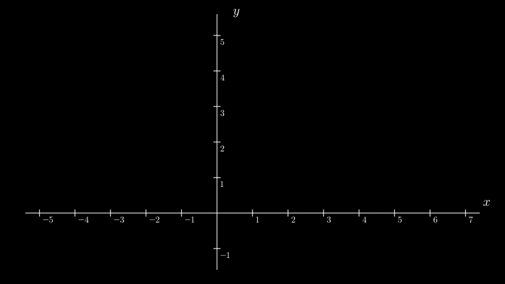

# Linear Algebra
* [Vectors](#vectors)
    * [Vector Magnitude and Direction](#vector-magnitude-and-direction)
    * [Vector Addition](#vector-addition)
    * [Vector Scalar Multiplication](#vector-scalar-multiplication)
    * [Vector Linear Combination](#vector-linear-combination)
    * [Vector Linear Dependence](#vector-linear-dependence)
    * [Vector Span and Basis](#vector-span-and-basis)
    * [Vector Space](#vector-space)

## Vectors

A vector may have many definitions: a point in space, an ordered list of numbers, a quantity with magnitude and
direction, etc. More abstractly, a vector is simply an element of a [vector space](#vector-space). All these diverse
things are gathered under the common name of vector because, for certain types of questions, a common way of reasoning
can be applied to all of them.

### Vector Magnitude and Direction

The **magnitude of a vector** ( $||\vec{a}||$ ) is the distance from the endpoint of the vector to the origin. It's a
number that represents the length of the vector independent of the direction. To calculate the magnitude of a vector we
can use the [Pythagorean theorem](https://en.wikipedia.org/wiki/Pythagorean_theorem):
$`||\vec{a}||=\sqrt{x_{a}^2 + y_{a}^2}`$.

A **unit (normalized) vector** ( $\hat{a}$ ), on the other hand, represents the direction of the vector independent of
its length.
The magnitude of a unit vector is always 1. To calculate the unit vector of any vector, we take the original vector and
divide it by its magnitude:
$`\hat{a} = \frac{\vec{a}}{||\vec{a}||}`$.

We can use these two components to re-create the original vector by multiplying the unit vector by the length of the
original vector:
$`\vec{a} = \hat{a} * ||\vec{a}||`$.

### Vector Addition

Graphically, we can think of **adding two vectors** together as placing these vectors so the tail of the second one
sits on the tip of the first one. The sum is a vector drawn from the origin to the tip of the second vector.

**Vector subtraction** works similarly. We place the tip of the smaller vector to sit on the tip of the bigger one and
draw the result vector from the origin to the tail of the smaller vector.

Numerically, we add/subtract vectors **component by component**:
$`\vec{c} = \vec{a} + \vec{b} = \begin{bmatrix} x_{a} + x_{b} \\ y_{a} + y_{b} \end{bmatrix}`$

### Vector Scalar Multiplication

Graphically, we **multiply a vector by a number (scalar)** to either stretch or squish the vector (scale it).
Multiplying a vector by a negative number also **flips its direction**.

Numerically, we multiply/divide every **vector's component by the number**:
$`\vec{a} * c = \begin{bmatrix} x_{a} * c \\ y_{a} * c \end{bmatrix}`$

### Vector Linear Combination

**Linear combinations** of vectors are obtained by using [vector addition](#vector-addition) and
[vector scalar multiplication](#vector-scalar-multiplication). For example, a linear combination of vectors
$\vec{v_{1}}$ and $\vec{v_{2}}$ would be an expression of the form $c_{1}\vec{v_{1}} + c_{2}\vec{v_{2}}$, where $c_{1}$
and $c_{2}$ are some constants.

### Vector Linear Dependence

Vectors are said to be **linearly dependent** if there exists a nontrivial (where scalars are not all zero)
[linear combination](#vector-linear-combination) of the vectors that equals the zero vector:
$`c_{1}\vec{v_{1}} + c_{2}\vec{v_{2}} + ... + c_{n}\vec{v_{n}} = 0`$.
If the set of vectors is **infinite**, the vectors in it are considered to be linearly dependent if the set contains a
**finite subset that is linearly dependent**.

Graphically, vectors are linearly dependent if **two vectors are on the same line** (for 2D) or if **three vectors are
on the same plane** (for 3D). It means that **one vector can be expressed as a linear combination of the other/s**. The
maximum number of possible linearly independent vectors is the same as the dimension of the
[vector space](#vector-space).

### Vector Span and Basis

The **span** of vectors is the set of all their [linear combinations](#vector-linear-combination). The **basis** of a
[vector space](#vector-space) is a set of linearly independent vectors that **span** the full space. For example, by
using linear combinations of any two linearly independent vectors, we can create any vector in the 2D space.

The **basis** vectors in the $x,y$ coordinate system are vectors $\hat{i},\hat{j}$ (i-hat and j-hat).

### Vector Space

A **vector space**, simplified, is a collection of vectors, along with two defined operations you can do on them:
[vector addition](#vector-addition) and [scalar multiplication](#vector-scalar-multiplication). Vector spaces are
characterized by their dimension, which specifies the maximum number of
[linearly independent](#vector-linear-dependence) vectors in the space.

To have a vector space, the **eight following axioms must be satisfied**:

- Associativity of vector addition:
  $`\vec{u} + (\vec{v} + \vec{w}) = (\vec{u} + \vec{v}) + \vec{w}`$;
- Commutativity of vector addition:
  $`\vec{u} + \vec{v} = \vec{v} + \vec{u}`$;
- Identity element of vector addition (zero vector $\vec{0}$):
  $`\vec{v} + \vec{0} = \vec{v}`$;
- Inverse elements of vector addition:
  $`\vec{v} + (-\vec{v}) = \vec{0}`$;
- Compatibility of scalar multiplication with field multiplication:
  $`a(b\vec{v}) = (ab)\vec{v}`$;
- Identity element of scalar multiplication:
  $`1\vec{v} = \vec{v}`$;
- Distributivity of scalar multiplication with respect to vector addition:
  $`a(\vec{v} + \vec{u}) = a\vec{v} + a\vec{u}`$;
- Distributivity of scalar multiplication with respect to field addition:
  $`(a + b)\vec{v} = a\vec{v} + b\vec{v}`$.
