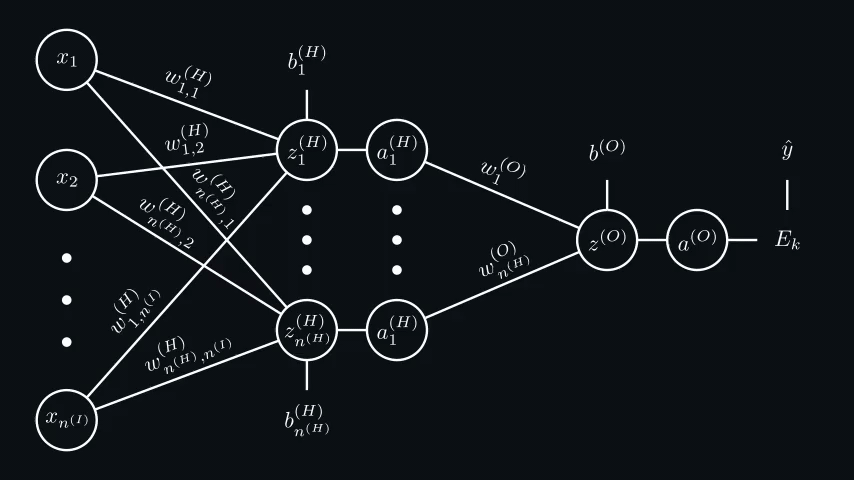

# Machine Learning

## Neural Networks

**Artificial Neural Network** is a model inspired by the structure and function of biological neural networks in brains.
They can learn from experience, and can derive conclusions from a complex and seemingly unrelated set of information.

### Neurons and Forward Propagation

Neural networks are composed of **neurons** (or **units**), where each neuron individually performs only a simple
computation. The power of a neural network comes instead from the complexity of the connections these neurons can form.


Each artificial neuron ($a$) has **inputs ($x_n$)** and **produces a single output ($y$)**. Every input is multiplied by
its own **weight $w_n$**. Some **inputs can be configured to affect the output more than the others** by setting bigger
weights. For example, if your network has to classify guitar and drum photos, the input sequence that highlights strings
should have a bigger weight than the one that highlights wood (it's an exaggerated example, but you got the idea). In
addition to weights, the neuron's output is controlled by a **bias $b$**. The bias enables the neuron to modify the
output independently of its inputs. All of that summed together is wrapped in a non-linear function, which is called an
**activation function**, a [sigmoid](https://en.wikipedia.org/wiki/Sigmoid_function) $\sigma$ function in this example.
Functions like sigmoid only output values between 0 and 1, making it useful for **binary classification problems** as
they can output a "probability" value. The complete neuron formula looks like this:

```math
a = \sigma(\sum_{i=1}^{n} w_i x_i + b)
```

```math
\sigma(x) = \frac{1}{1+e^{-x}}
```

The output of a neuron can be sent to multiple other neurons. The formula stays the same, just input $x$ is replaced
with the output of another neuron $a$. Usually, **neurons in a network are organized in layers**. The simplest neural
network has 3 layers: the input layer $(I)$, the hidden layer $(H)$, and the output layer $(O)$. The number of nodes $n$
in each layer might be different but usually is smaller in every next layer. The number of neurons in the output layer
depends on the task. For example, if we want to classify something into 10 categories, we need 10 neurons in the output
layer. If we want to classify something into only 2 categories, a single output neuron might be enough (values closer to
0 represent the first category, closer to 1 represent the second one). The number of neurons in the hidden layer often
requires testing. A logical question for the default value might be "How many patterns do you want the network to
recognize in the input data?" but the answer is often very vague.


The neural network structure should be clear, but now all these indices look terrifying. Let's unwrap them layer by
layer. $x$ is the input. There's no need to calculate it, it's just given. Everything that belongs to the input layer is
marked by a superscript $(I)$ (it's not power, it's yet another label), so $n^{(I)}$ is the number of neurons in the
input layer. A superscript $(H)$ is used for the hidden layer, so $n^{(H)}$ is the number of neurons in the hidden
layer, and $w_{j,i}^{(H)}$ denotes the weight for the connection between the input and the hidden layer neurons. The
indices $j,i$ might feel backward, but it lines up with how you execute matrix multiplications (you might understand it
better if you look at the code of a [practical example](https://github.com/maksyche/spam-detector)). The same idea is
applied to the output layer $(O)$, but it has lesser indices, cause it comprises a single output neuron. Now, let's
write down all the formulas to calculate neuron values at each level:

```math
a_{j}^{(H)} = \sigma(\sum_{i=1}^{n^{(I)}} w_{j,i}^{(H)}x_{i} + b_{j}^{(H)})
```

```math
a^{(O)} = \sigma(\sum_{j=1}^{n^{(H)}} w_{j}^{(O)}a_{j}^{(H)} + b^{(O)})
```

**Why do we need an activation function?** Activation functions are necessary to **prevent linearity**.
$\sum_{i=1}^{n} w_i x_i + b$ is a linear function. The **composition of linear functions is a linear function**, so no
matter how many layers of neurons the data goes through, they all can be replaced by a single linear function. The
non-linearity is critical because, without it, you can't approximate non-linear functions well (imagine a children's
drawing book where you need to connect all the dots to get a picture of a cat, but you can only draw a single straight
line somewhere through the middle of the picture).

**What can be used as an input? Usually, a neural network takes a
[vector](../linear-algebra/README.md#introduction-to-vectors) of values between $[-1, 1]$ as an input. So, anything can
be an input if it can be meaningfully represented with numbers.** For example, a neural network that classifies
greyscale pictures takes a vector of pixels of images as an input. Each pixel has a value between $[0, 255]$ that
represents its brightness, so it should be normalized to $[0, 1]$ before entering the network.

The process of passing input data through the whole network, applying weights and biases, and computing the final output
is called **Forward Propagation**.

### Backpropagation

The output of a neural network doesn't make any sense until the network is trained. **Training the network is just
setting weights and biases in such a way that the output of the whole network satisfies our needs for all/most of the
input samples.** The method that trains the network is called **Backpropagation**.

**The main idea of this algorithm is to compare the current output of the network with the expected output for all
training samples (the more, the better), calculate the error (the deviation between expected and actual outputs), and
slightly change weights and biases in the direction that gives the biggest decrease of the error.** Mathematically, it's
built upon the idea of the [gradient descend](../calculus/README.md#the-gradient-of-a-function).

**If you had to train the network manually**, you'd try to configure the hidden layer neurons to recognize some patterns
and then the neurons of the output layer to decide how the presence or absence of each pattern affects the output. This
can be done by adjusting the weights and biases. For example, if we had a network that classifies handwritten digits on
greyscale pictures, one neuron of the hidden layer might be responsible for recognizing a round shape in the top half of
the picture. A bias of this neuron would be set to activate the neuron only if most of the pixels within the round shape
are bright enough and the weights of the connections to the pixels outside of the round shape would be negative to
deactivate the neuron if some other shapes are present in the region. Then, having a round shape in the top half of the
picture (so, this neuron activated) means that the connections from this neuron to output neurons that represent numbers
like 8 or 9 should have bigger weights, and connections to other output neurons should have smaller or even negative
weights. But, as you might have noticed, it's very hard to come up with all the required patterns and almost impossible
to tweak weights and biases correctly. So, **the goal of backpropagation is to make the network come up with these
patterns during learning and tweak weights and biases to achieve better results.**

Correct initialization of weights and biases is very important. Usually, the biases are initialized as 0s, and the
weights are initialized randomly, but
[uniformly distributed](https://en.wikipedia.org/wiki/Continuous_uniform_distribution) over some interval. The interval
depends on the number of neurons in layers (Glorot initialization is the most popular one).

Now, math time. The [Mean Squared Error](https://en.wikipedia.org/wiki/Mean_squared_error) is commonly used as the error
function (in many sources, the terms cost, loss and error functions are interchangeable). Here are formulas to calculate
the error for all samples and a single sample. $n^{(S)}$ denotes the total number of samples and $\hat{y}$ denotes the
expected output.

```math
E = \frac{1}{n^{(S)}} \sum_{k=1}^{n^{(S)}}E_{k}
```

```math
E_{k} = (a^{(O)} - \hat{y})^2
```

To calculate new weights and biases, we need to calculate how an infinitely small change to every each one of them
affects the error, thus calculate a [partial derivative](../calculus/README.md#partial-derivatives) of the error with
respect to every weight and bias. Then, we have to multiply this derivative by $-1$ to go in the direction of
decreasing the error, and add the result to the old weight or bias. Additionally, we need to introduce learning rate
$\eta$ (pronounced as "eta") - a small multiplier (often defaults to $0.01$) that makes learning slower but more
precise.

```math
w_{new} = w - \eta\frac{\partial E}{\partial w} 
= w - \eta \cdot \frac{1}{n^{(S)}} \sum_{k=1}^{n^{(S)}}\frac{\partial E_{k}}{\partial w} 
```

```math
b_{new} = b - \eta\frac{\partial E}{\partial b} 
= b - \eta \cdot \frac{1}{n^{(S)}} \sum_{k=1}^{n^{(S)}}\frac{\partial E_{k}}{\partial b} 
```

For the convenience of derivative calculations, let's split neuron functions into summation and activation functions:

```math
a_{j}^{(H)} = \sigma(z_{j}^{(H)})
```

```math
z_{j}^{(H)} = \sum_{i=1}^{n^{(I)}} w_{j,i}^{(H)}x_{i} + b_{j}^{(H)}
```

```math
a^{(O)} = \sigma(z^{(O)})
```

```math
z^{(O)} = \sum_{j=1}^{n^{(H)}} w_{j}^{(O)}a_{j}^{(H)} + b^{(O)}
```

To calculate a partial derivative of the error with respect to some weight, we need to calculate partial derivatives of
the components that are also affected by the change of this weight in the
[chain](https://en.wikipedia.org/wiki/Chain_rule) up to the error. The same works for biases.



Complete set of the partial derivatives of the error with respect to weights and biases of the hidden and output layers
of this network:

```math
\frac{\partial E_{k}}{\partial w_{j,i}^{(H)}} =
\frac{\partial z_{j}^{(H)}}{\partial w_{j,i}^{(H)}}
\cdot \frac{\partial a_{j}^{(H)}}{\partial z_{j}^{(H)}}
\cdot \frac{\partial z^{(O)}}{\partial a_{j}^{(H)}}
\cdot \frac{\partial a^{(O)}}{\partial z^{(O)}}
\cdot \frac{\partial E_{k}}{\partial a^{(O)}} 
```

```math
\frac{\partial E_{k}}{\partial b_{j}^{(H)}} =
\frac{\partial z_{j}^{(H)}}{\partial b_{j}^{(H)}}
\cdot \frac{\partial a_{j}^{(H)}}{\partial z_{j}^{(H)}}
\cdot \frac{\partial z^{(O)}}{\partial a_{j}^{(H)}}
\cdot \frac{\partial a^{(O)}}{\partial z^{(O)}}
\cdot \frac{\partial E_{k}}{\partial a^{(O)}} 
```

```math
\frac{\partial E_{k}}{\partial w_{j}^{(O)}} =
\frac{\partial z^{(O)}}{\partial w_{j}^{(O)}}
\cdot \frac{\partial a^{(O)}}{\partial z^{(O)}}
\cdot \frac{\partial E_{k}}{\partial a^{(O)}} 
```

```math
\frac{\partial E_{k}}{\partial b^{(O)}} =
\frac{\partial z^{(O)}}{\partial b^{(O)}}
\cdot \frac{\partial a^{(O)}}{\partial z^{(O)}}
\cdot \frac{\partial E_{k}}{\partial a^{(O)}} 
```

Now, we have all the formulas. You may have noticed that many components are reused. Let's calculate the derivatives of
these components:

```math
\frac{\partial E_{k}}{\partial a^{(O)}} = 2(a^{(O)} - \hat{y})
```

```math
\frac{\partial a^{(O)}}{\partial z^{(O)}} = \sigma^{\prime}(z^{(O)}) = \sigma(z^{(O)})(1-\sigma(z^{(O)}))
```

```math
\frac{\partial z^{(O)}}{\partial a_{j}^{(H)}} = w_j^{(O)}
```

```math
\frac{\partial a_{j}^{(H)}}{\partial z_{j}^{(H)}} = \sigma(z_{j}^{(H)})(1-\sigma(z_{j}^{(H)}))
```

Other missing derivatives:

```math
\frac{\partial z_{j}^{(H)}}{\partial w_{j,i}^{(H)}} = x_{i}
```

```math
\frac{\partial z_{j}^{(H)}}{\partial b_{j}^{(H)}} = 1
```

```math
\frac{\partial z^{(O)}}{\partial w_{j}^{(O)}} = a_{j}^{(H)} 
```

```math
\frac{\partial z^{(O)}}{\partial b^{(O)}} = 1
```

**Going through the whole training dataset once and adjusting all the weights and biases means finishing one training
epoch.** Doing that MANY times will eventually make the error go down very close to 0, and the network will be trained.
**Neural network is only as good as the dataset it's trained on**. It's recommended to split the dataset into training
and validation subsets and verify that the success rate of the classification of the validation subset is going up when
the error is going down. Sometimes, the error may be still going down, but the success rate may start decreasing. This
might be a sign of [overfitting](https://en.wikipedia.org/wiki/Overfitting#Machine_learning). Using a better weight
initialization scheme and a lower learning rate may improve the results of your network.

You can look at the [practical project](https://github.com/maksyche/spam-detector) that uses an ANN with the same
structure written from scratch.
