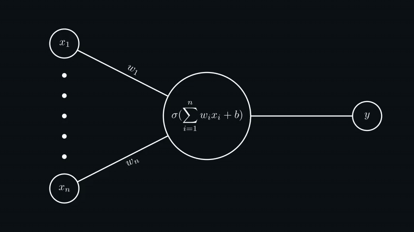
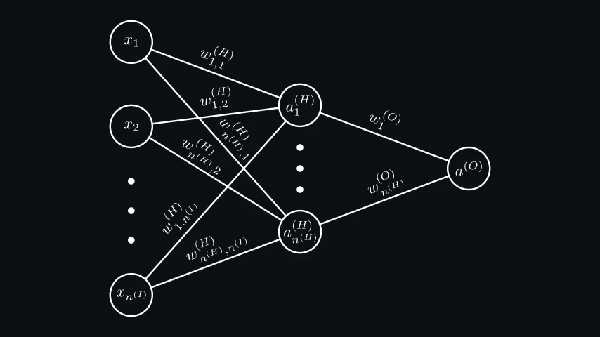

# Machine Learning

## Neural Networks

**Artificial Neural Network** is a model inspired by the structure and function of biological neural networks in brains.
They can learn from experience, and can derive conclusions from a complex and seemingly unrelated set of information.

### Neurons and Forward Propagation

Neural networks are composed of **neurons** (or **units**), where each neuron individually performs only a simple
computation. The power of a neural network comes instead from the complexity of the connections these neurons can form.



Each artificial neuron ($a$) has **inputs ($x_n$)** and **produces a single output ($y$)**. Every input is multiplied by
its own **weight $w_n$**. Some **inputs can be configured to affect the output more than the others** by setting bigger
weights. For example, if your network has to classify guitar and drum photos, the input sequence that highlights strings
should have a bigger weight than the one that highlights wood (it's an exaggerated example, but you got the idea). In
addition to weights, the neuron's output is controlled by a **bias $b$**. The bias enables the neuron to modify the
output independently of its inputs. All of that summed together is wrapped in a non-linear function, which is called an
**activation function**, a [sigmoid](https://en.wikipedia.org/wiki/Sigmoid_function) $\sigma$ function in this example.
Functions like sigmoid only output values between 0 and 1, making it useful for **binary classification problems** as
they can output a "probability" value. The complete neuron formula looks like this:

```math
a = \sigma(\sum_{i=1}^{n} w_i x_i + b)
```

```math
\sigma(x) = \frac{1}{1+e^{-x}}
```

The output of a neuron can be sent to multiple other neurons. The formula stays the same, just input $x$ is replaced
with the output of another neuron $a$. Usually, **neurons in a network are organized in layers**. The simplest neural
network has 3 layers: the input layer $(I)$, the hidden layer $(H)$, and the output layer $(O)$. The number of nodes $n$
in each layer might be different but usually is smaller in every next layer. The number of neurons in the output layer
depends on the task. For example, if we want to classify something into 10 categories, we need 10 neurons in the output
layer. If we want to classify something into only 2 categories, a single output neuron might be enough (values closer to
0 represent the first category, closer to 1 represent the second one). The number of neurons in the hidden layer often
requires testing. A logical question for the default value might be "How many patterns do you want the network to
recognize in the input data?" but the answer is often very vague.



The neural network structure should be clear, but now all these indices look terrifying. Let's unwrap them layer by
layer. $x$ is the input. There's no need to calculate it, it's just given. Everything that belongs to the input layer is
marked by a superscript $(I)$ (it's not power, it's yet another label), so $n^{(I)}$ is the number of neurons in the
input layer. A superscript $(H)$ is used for the hidden layer, so $n^{(H)}$ is the number of neurons in the hidden
layer, and $w_{j,i}^{(H)}$ denotes the weight for the connection between the input and the hidden layer neurons. The
indices $j,i$ might feel backward, but it lines up with how you execute matrix multiplications (you might understand it
better if you look at the code of a [practical example](https://github.com/maksyche/spam-detector)). The same idea is
applied to the output layer $(O)$, but it has a lesser indices, cause it comprises a single output neuron. Now, let's
write down all the formulas to calculate neuron values at each level:

```math
a_{j}^{(H)} = \sigma(\sum_{i=1}^{n^{(I)}}w_{j,i}^{(H)}x_{i} + b_{j}^{(H)})
```

```math
a^{(O)} = \sigma(\sum_{j=1}^{n^{(H)}}w_{j}^{(O)}a_{j}^{(O)} + b^{(O)})
```

**Why do we need an activation function?** Activation functions are necessary to **prevent linearity**.
$\sum_{i=1}^{n} w_i x_i + b$ is a linear function. The **composition of linear functions is a linear function**, so no
matter how many layers of neurons the data goes through, they all can be replaced by a single linear function. The
non-linearity is critical because, without it, you can't approximate non-linear functions well (imagine a children's
drawing book where you need to connect all the dots to get a picture of a cat, but you can only draw a single straight
line somewhere through the middle of the picture).

**What can be used as an input? Usually, a neural network takes a
[vector](../linear-algebra/README.md#introduction-to-vectors) of values between $[-1, 1]$ as an input. So, anything can
be an input if it can be meaningfully represented with numbers.** For example, a neural network that classifies
greyscale pictures takes a vector of pixels of images as an input. Each pixel has a value between $[0, 255]$ that
represents its brightness, so it should be normalized to $[0, 1]$ before entering the network.

The process of passing input data through the whole network, applying weights and biases, and computing the final output
is called **Forward Propagation**.
